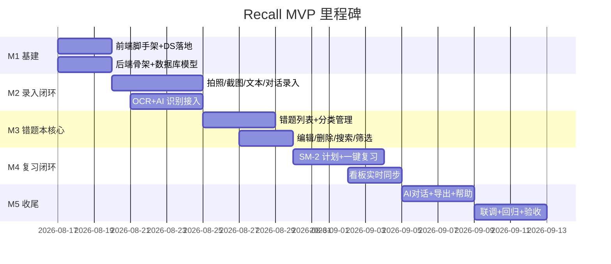
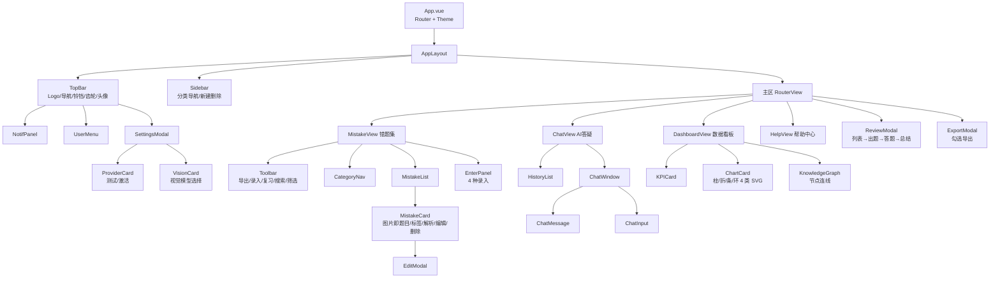
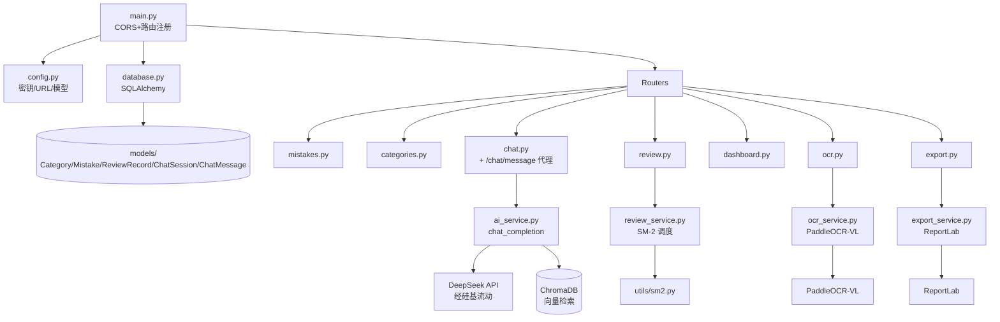

# Recall · AI 智能错题本 — 开发规划文档

| 项目 | 内容 |
|---|---|
| 文档版本 | v1.0 |
| 关联文档 | PRD（`recall-prd.md` v1.0）· UI/UX 设计（`recall-design-system.html` + `zhiwen-ai-design` DS 令牌） |
| 目标版本 | MVP 可交付版 |
| 技术栈 | Vue3 + TS + Vite + Tailwind · FastAPI + Uvicorn · SQLite · ChromaDB · DeepSeek API · PaddleOCR-VL · ReportLab |

---

## 1. 开发总纲

### 1.1 开发目标

依据 PRD G1–G4 与 FR-01~16，在既定技术栈上交付一个**可用、可测、可演示**的 MVP：四条录入链路可用、错题本闭环（录入→管理→复习→看板→导出）、AI 对话可用、非功能指标达标（NFR-01~12）。

### 1.2 范围界定

| 范围 | 内容 |
|---|---|
| ✅ In | FR-01~16 全部 MVP 功能；NFR-01~12 全部指标；三端响应式 |
| ⏸ Out（后续迭代） | 多用户账号体系、云端同步、班级/家校协作、移动端原生 App、付费会员 |
| ⚠️ 降级策略 | AI/OCR 调用失败回退本地 mock；无后端时单文件原型可独立演示 |

### 1.3 关键原则

1. **数据一致性优先**：分类计数 / 看板 KPI / 图表 必须实时同步（R4），任何写操作统一触发 `syncDashboard()`。
2. **三级降级兜底**：AI 调用按「前端直连 Provider → 后端代理 → 本地 mock」逐级降级，永不白屏（NFR-11）。
3. **无阴影设计铁律**：全代码库禁止 `box-shadow`，层级靠明度差 + 1px `#E5E5EA` 边框 + 留白（AC-14）。
4. **密钥不落前端**：生产环境 API Key 只存后端 `.env`，前端仅调代理接口（NFR-09）。
5. **图片即题目**：拍照/截图卡片题目区展示原图，OCR 文本仅内部使用（FR-06）。

### 1.4 团队角色与职责

| 角色 | 职责 |
|---|---|
| 前端工程师 | Vue3 组件开发、状态管理、API 对接、响应式、单文件原型维护 |
| 后端工程师 | FastAPI 路由/服务、SQLite/ChromaDB、SM-2、OCR/导出服务 |
| AI/算法工程师 | DeepSeek prompt 工程、视觉模型选型与降级、出题 JSON 规范化 |
| 测试工程师 | 功能验收（AC-01~15）、性能压测、回归脚本 |
| 产品/设计 | PRD 澄清、设计走查、验收口径裁定 |

---

## 2. 里程碑与任务分解

### 2.1 里程碑总览

### 2.2 任务分解（WBS）

| 里程碑 | 编号 | 任务 | 对应 FR | 交付物 |
|---|---|---|---|---|
| **M1 基建** | T1.1 | 前端脚手架（Vite+Vue3+TS+Tailwind+Pinia+Router） | — | 可运行工程 |
| | T1.2 | DS 令牌落地（`:root` 变量 + 组件库：Btn/Card/Tag/Input/Modal/Empty） | — | `styles/tailwind.css` 组件类 |
| | T1.3 | 后端骨架（main/config/database/依赖注入）+ 5 模型建表 | — | 可启动 FastAPI |
| | T1.4 | 路由挂载（mistakes/categories/chat/review/dashboard/ocr/export）+ CORS | — | OpenAPI 文档可访问 |
| **M2 录入闭环** | T2.1 | 录入引导页（4 方式卡片 + 面板切换） | FR-01~04 | 页面组件 |
| | T2.2 | 拍照/截图：摄像头调起、拖拽、粘贴、预览 | FR-01,02 | 可上传图片 |
| | T2.3 | 文本/对话录入表单与校验 | FR-03,04 | 可提交 |
| | T2.4 | OCR + AI 识别服务（PaddleOCR-VL / Qwen3-VL / 降级） | FR-01~04 | `ocr_service` + 前端 `ocrAndAnalyze` |
| | T2.5 | 识别结果 → 学科/知识点/解析 → 归档卡片 | FR-01~06 | 全链路可用 |
| **M3 错题本核心** | T3.1 | 错题列表 + 卡片组件（图片即题目/标签/解析折叠） | FR-06 | 列表页 |
| | T3.2 | 分类导航（8 学科+自定义增删+计数联动） | FR-05 | 侧栏 |
| | T3.3 | 编辑错题 modal（学科/知识点/题目/解析） | FR-16 | 可编辑 |
| | T3.4 | 删除/搜索/筛选 + 空状态 | FR-06 | 交互完整 |
| **M4 复习闭环** | T4.1 | SM-2 算法实现（utils/sm2.py）+ 复习计划列表 | FR-08 | 计划生成 |
| | T4.2 | 一键复习：AI 出题（ABCD JSON 规范化 + 容错） | FR-07 | 出题接口 |
| | T4.3 | 答题判分/高亮/解析/自评 → 复习次数+1 写回 | FR-07 | 复习会话 |
| | T4.4 | `syncDashboard()`：KPI/环形图/柱状图/图例实时刷新 | FR-09 | 看板同步 |
| | T4.5 | 数据看板图表组件（4 类 SVG 图 + 知识图谱） | FR-09 | 看板页 |
| **M5 收尾** | T5.1 | AI 对话（多轮上下文 + 流式 + 推荐问题 + mock 兜底） | FR-11 | 答疑页 |
| | T5.2 | 模型供应商配置（3 provider 测试/激活 + 视觉模型选择） | FR-15 | 设置 tab |
| | T5.3 | 导出 PDF/Markdown（勾选导出 + 中文无乱码） | FR-10 | 导出链路 |
| | T5.4 | 帮助中心 FAQ + 通知铃铛 + 用户菜单 + 常规设置 | FR-12~14 | 收尾页 |
| | T5.5 | 联调、AC 回归、性能压测、响应式走查 | AC-01~15 | 验收报告 |

---

## 3. 组件/模块依赖树

### 3.1 前端组件树

### 3.2 后端模块树

### 3.3 依赖约束

| 约束 | 说明 |
|---|---|
| 前端组件单向依赖 | 页面 → 模块组件 → 通用组件；禁止反向 import |
| 后端分层依赖 | Router → Service → Model/外部服务；Service 不依赖 Router |
| 状态共享 | 错题/分类走 Pinia（mistake store）；主题走 localStorage；AI 供应商配置走 localStorage |
| 无阴影铁律 | 所有组件 CSS 不得出现 `box-shadow`（AC-14，CI 校验） |

---

## 4. API 契约

> Base URL：`http://localhost:8000`；统一响应 `{code, data, message}`；鉴权：MVP 无登录态，预留 `X-User-Id` 头。

### 4.1 错误码规范

| code | 含义 |
|---|---|
| 0 | 成功 |
| 40001 | 参数校验失败 |
| 40401 | 资源不存在（错题/分类/会话） |
| 50001 | AI 服务不可用（上游失败） |
| 50002 | OCR 识别失败 |
| 50003 | 导出生成失败 |

### 4.2 错题 Mistake

| 方法 | 路径 | 说明 | 请求体（示例） | 响应（示例） |
|---|---|---|---|---|
| GET | `/api/mistakes?category_id=&subject=&keyword=&page=&size=` | 分页查询错题 | — | `{code:0,data:{items:[...],total:11}}` |
| POST | `/api/mistakes` | 新增（AI 归档） | `{question, image_base64?, subject?, knowledge_point?, source, analysis?}` | `{code:0,data:{id:101,...}}` |
| PUT | `/api/mistakes/{id}` | 编辑学科/知识点/题目/解析 | `{subject, knowledge_point, question, analysis}` | `{code:0}` |
| DELETE | `/api/mistakes/{id}` | 删除错题 | — | `{code:0}` |
| POST | `/api/mistakes/batch` | 批量导入（多题勾选） | `{items:[{...}]}` | `{code:0,data:{imported:2}}` |

**Mistake 模型字段**：`id, category_id, subject, knowledge_point, question, question_image, source, analysis, mastery_level(0-5), review_count, error_reason, created_at, next_review_at`

### 4.3 分类 Category

| 方法 | 路径 | 说明 | 响应（示例） |
|---|---|---|---|
| GET | `/api/categories` | 分类列表（含计数） | `{code:0,data:[{id,name,color,count}]}` |
| POST | `/api/categories` | 新建分类 | `{code:0,data:{id,color}}` |
| DELETE | `/api/categories/{id}` | 删除分类 | `{code:0}` |

### 4.4 AI 对话 Chat

| 方法 | 路径 | 说明 | 请求体 | 响应 |
|---|---|---|---|---|
| POST | `/api/chat/message` | 无状态 AI 代理（密钥在后端） | `{messages:[{role,content}], temperature?}` | `{code:0,data:{reply:"..."}}` |
| POST | `/api/chat/sessions` | 新建会话 | — | `{code:0,data:{session_id}}` |
| GET | `/api/chat/sessions` | 历史会话列表 | — | `{code:0,data:[...]}` |
| POST | `/api/chat/messages` | 记录消息（流式完成后落库） | `{session_id, role, content}` | `{code:0}` |

> 流式扩展（S2）：`POST /api/chat/stream` 返回 `text/event-stream`，首字 ≤ 2s（NFR-02）。

### 4.5 复习 Review

| 方法 | 路径 | 说明 | 请求体 | 响应 |
|---|---|---|---|---|
| GET | `/api/review/plan?scope=daily|weekly|pre-exam` | SM-2 复习计划 | `{code:0,data:{items:[{id,due}]}}` |
| POST | `/api/review/{mistake_id}/submit` | 提交自评/答题结果 | `{self_rating:1|3|5, correct:bool}` | `{code:0,data:{next_review_at, interval}}` |
| GET | `/api/review/quiz` | AI 出题（ABCD 选项） | `{mistake_id}` | `{code:0,data:{options:[{letter,text,is_correct}],correct,explanation}}` |

### 4.6 数据看板 Dashboard

| 方法 | 路径 | 说明 | 响应 |
|---|---|---|---|
| GET | `/api/dashboard/summary` | KPI 聚合 | `{code:0,data:{total,mastered,reviewing,todo,avg_review}}` |
| GET | `/api/dashboard/subjects` | 学科分布 | `{code:0,data:[{subject,count}]}` |
| GET | `/api/dashboard/trend?days=7` | 录入趋势 | `{code:0,data:[{date,count}]}` |
| GET | `/api/dashboard/weak-points` | 薄弱知识点 | `{code:0,data:[{point,count,rate}]}` |

### 4.7 OCR / 导出

| 方法 | 路径 | 说明 | 请求体 | 响应 |
|---|---|---|---|---|
| POST | `/api/ocr/recognize` | PaddleOCR-VL 识别 | `{image_base64}` | `{code:0,data:{text,subjects?}}` |
| POST | `/api/export/pdf` | ReportLab 生成 PDF | `{ids:[...]}` | 文件流 `application/pdf` |
| POST | `/api/export/markdown` | 生成 Markdown | `{ids:[...]}` | `{code:0,data:{content,filename}}` |

---

## 5. 开发规范

### 5.1 设计规范（对齐 UI/UX 文档）

| 项 | 规范 |
|---|---|
| 色彩 | 一律走 `:root` 变量（`--primary:#007AFF` 等）；组件内禁写 hex（除 DS 定义的浅底色 #F2F7FF/#F0FBF5） |
| 无阴影 | **全库禁 `box-shadow`**；聚焦用 `border-color:var(--primary)` 或 1px outline |
| 间距 | 8px 栅格：xs4/sm8/md12/lg16/xl24/xxl32；卡片内边距 lg-xl |
| 圆角 | 按钮/输入 8px · 卡片 12px · 标签 6px |
| 字阶 | H1 28/600 · H2 20/600 · Body 14/400 · Caption 12/400 |
| 图标 | 内联线框 SVG：导航 20 / 内容 16 / 按钮 14 |
| 响应式 | ≥1024 双栏 · 768–1023 侧栏收窄 · <768 单栏+横向滑动 |
| 主题 | 默认暗黑二次元（`#0E0C1D` 系）；保留 DS 极简蓝调为浅色变体 |

### 5.2 前端规范

- **TS 严格模式**：禁止 `any` 裸奔；共享类型进 `types/index.ts`（Mistake/Category/ChatMessage/QuizData）。
- **组件命名**：PascalCase 文件、kebab-case 标签；页面级放 `views/`，可复用放 `components/`。
- **状态管理**：业务数据走 Pinia（mistake/chat store）；UI 瞬态用组件内 ref；配置类走 localStorage。
- **API 层**：统一 `api/index.ts`（Axios 实例 + 拦截器 + 错误码 toast），禁止在组件内裸 fetch（原型文件除外）。
- **安全**：所有用户输入经 `escapeHtml`/`v-html` 禁用（NFR-10）。
- **性能**：错题列表 > 200 条启用虚拟滚动（NFR-05）。

### 5.3 后端规范

- **分层**：Router（薄）→ Service（业务）→ Model（ORM）；DTO 用 Pydantic v2。
- **配置**：密钥读环境变量 / `.env`（pydantic-settings），`config.py` 不提交真实 Key（NFR-09）。
- **异步**：AI/OCR 调用用 `httpx.AsyncClient` + 超时（连接 10s / 读 60s），失败抛 `AIServiceError`。
- **AI prompt 规范**：结构化输出一律要求严格 JSON 并在 Service 层正则兜底解析；出题失败抛 `QuizGenerateError` 由前端降级。
- **SQLite 并发**：开启 WAL；写操作串行化；`next_review_at` 建索引。

### 5.4 工程与协作规范

- **Git**：trunk-based；`feat/` `fix/` `refactor/` 前缀；提交信息含 FR/AC 编号（如 `feat(mistake): 分类筛选 FR-06`）。
- **CI 检查**（提交前必须通过）：ESLint + TS 类型检查 + `grep -c box-shadow` 为 0 + 后端 `py_compile`。
- **Demo 单文件**：保留 `recall-app.html` 自包含原型，任何组件改动需同步原型（NFR-12）。
- **文档**：接口改动同步本契约 §4；DS 变更同步 `design-system.md`。

---

## 6. 风险矩阵

| 编号 | 风险 | 概率 | 影响 | 等级 | 缓解措施 |
|---|---|---|---|---|---|
| R01 | AI 出题返回非 JSON / 选项不全 | 高 | 中 | 🔴 | prompt 严格约束 + 正则提取 + Service 层校验 + 前端降级「看解析+自评」（R5） |
| R02 | OCR 识别率低（手写/复杂公式） | 中 | 高 | 🔴 | 视觉模型可切换（Qwen3-VL/DeepSeek-OCR/PaddleOCR-VL）；识别失败引导文本录入；人工可编辑修正 |
| R03 | 密钥泄露（前端直连 Provider） | 中 | 高 | 🔴 | 生产收敛到后端代理；设置页明文展示改为掩码；提示用户轮换密钥 |
| R04 | 10000+ 错题列表卡顿 | 中 | 中 | 🟡 | 分页 + 虚拟滚动；`next_review_at` 索引；看板聚合走后端 SQL |
| R05 | 无阴影规范被破坏（回归） | 低 | 低 | 🟡 | CI grep 校验 `box-shadow`=0；设计走查卡点 |
| R06 | 大模型上游限流/超时 | 中 | 中 | 🟡 | 三级降级（直连→代理→mock）；重试 1 次 + 指数退避；请求队列限流 |
| R07 | 摄像头 API 兼容性（移动端） | 中 | 低 | 🟡 | `capture=environment` + 相册/拖拽/粘贴多入口兜底；提示 https/localhost |
| R08 | 看板与列表数据不一致 | 中 | 高 | 🔴 | 统一 `syncDashboard()` 触发点（增/删/改/复习）；状态单源（Pinia） |
| R09 | CORS 配置错误导致 AI 直连失败 | 低 | 中 | 🟡 | 开发环境 `*`；生产白名单；联调阶段专项验证 |
| R10 | 时间与范围蔓延 | 中 | 中 | 🟡 | 里程碑冻结；P0 优先；Out 范围一律排后续迭代 |

---

## 7. 验收标准

### 7.1 功能验收（映射 PRD AC）

| 阶段 | 验收项 | 标准（通过条件） |
|---|---|---|
| M2 结束 | 录入闭环 | 拍照/截图 2–3s 识别归档正确学科；文本/对话 AI 判学科+解析；图片即题目无冗余文字（AC-01,02） |
| M3 结束 | 错题本核心 | 分类筛选/新建/删除计数联动；编辑保存后分类重算；搜索命中（AC-03） |
| M4 结束 | 复习闭环 | ABCD 出题→判分高亮→解析→自评→复习次数+1；中途退出进度保留；看板实时同步（AC-04,05,06） |
| M5 结束 | 收尾功能 | PDF 中文无乱码可下载；AI 对话回复+失败 mock 兜底；FAQ 可折叠（AC-07,08,09,10） |

### 7.2 非功能验收（映射 PRD AC）

| 编号 | 验收项 | 标准 |
|---|---|---|
| AC-11 | 性能 | API P95 ≤ 500ms；AI 首字 ≤ 2s；OCR ≤ 10s；首屏 ≤ 2s |
| AC-12 | 容量 | 10000 条错题下列表滚动无明显卡顿 |
| AC-13 | 响应式 | 三档断点布局正确、功能可用 |
| AC-14 | 设计规范 | 全库 `box-shadow` = 0；深色主题默认；DS 令牌一致 |
| AC-15 | 回归 | JS 语法校验通过、`</html>` 闭合、无残留旧色值、核心交互无阻断缺陷 |

### 7.3 发布门槛（DoD）

- [ ] AC-01~15 全部通过（含自动化回归脚本）
- [ ] 无 P0/P1 缺陷；P2 缺陷 ≤ 5 且均有 workaround
- [ ] 前后端联调完成，`/api/chat/message` 与导出链路实测通过
- [ ] 演示环境（单文件原型 + 后端可选）可一键演示
- [ ] API 契约文档与实现一致（§4）

---

## 8. 开发节奏建议

### 8.1 迭代节奏（3 周冲刺）

| 冲刺 | 周期 | 目标 | 范围 |
|---|---|---|---|
| Sprint 0 | 3 天 | 基建落地 | T1.1–T1.4：脚手架、DS 组件库、后端骨架、CI 校验 |
| Sprint 1 | 5 天 | 录入闭环 | T2.1–T2.5：四录入 + OCR/AI 识别 + 归档 |
| Sprint 2 | 4 天 | 错题本核心 | T3.1–T3.4：列表/分类/编辑/搜索删除 |
| Sprint 3 | 5 天 | 复习闭环 | T4.1–T4.5：SM-2、出题、答题、看板同步 |
| Sprint 4 | 4 天 | 收尾 | T5.1–T5.5：对话/设置/导出/帮助/联调验收 |

### 8.2 每日节奏

| 时间 | 事项 |
|---|---|
| 站会 15min | 昨日完成（对 FR 编号）、今日计划、阻塞项 |
| 每日 17:00 | CI 全绿检查（lint/type/无阴影/语法） |
| 评审会（每周五） | 演示本周增量 → 对照 AC 打勾 → 更新风险矩阵 |

### 8.3 质量闸门（Gate）

| Gate | 触发时机 | 通过条件 |
|---|---|---|
| G1 | Sprint 0 结束 | 脚手架可跑、DS 组件库 5 组件齐、CI 校验生效 |
| G2 | Sprint 1 结束 | 四录入全链路可用（含降级） |
| G3 | Sprint 3 结束 | 复习闭环 + 看板同步演示通过 |
| G4 | Sprint 4 结束 | AC-01~15 全绿 → 发布 MVP |

### 8.4 联调与测试安排

- **联调窗口**：Sprint 2 末起每周 2 天，前后端同场修契约偏差。
- **测试重点**：录入四链路 × 识别成败 × 导出格式；复习出题 JSON 容错；看板同步一致性（R4/R08 专项）。
- **性能压测**：Sprint 3 末用 10k 造数脚本验证 AC-12；首屏用 Lighthouse 验 AC-04。

### 8.5 里程碑验收会议

每个里程碑结束后召开 30min 验收会：产品对照 PRD AC 打勾，设计走查视觉规范（AC-14），工程确认无 P0/P1 缺陷，通过后进入下一里程碑。

---

*文档结束 · Recall 开发规划 v1.0 · 与 PRD v1.0 / Design System v1.0 对齐*
