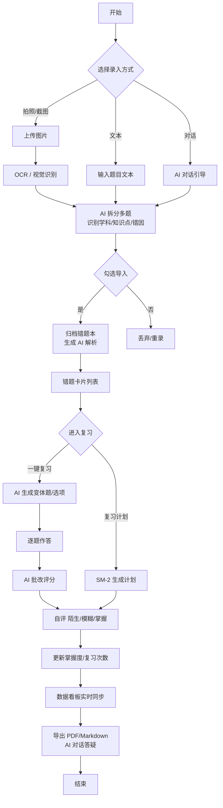
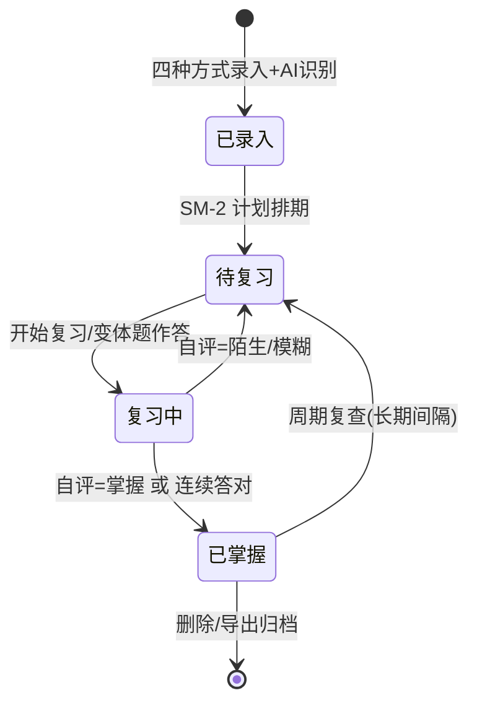
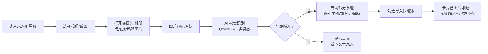
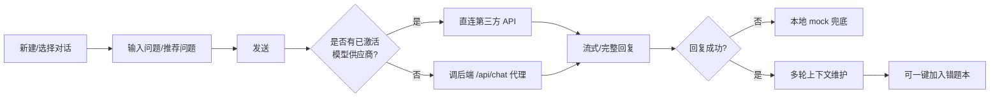
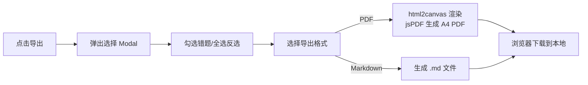
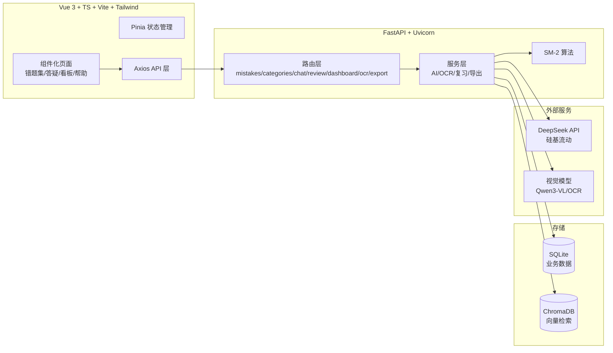

# Recall · AI 智能错题本 — 产品需求文档（PRD）

| 项目 | 内容 |
|---|---|
| 文档版本 | v1.0 |
| 产品名称 | Recall · AI 智能错题本 |
| 产品形态 | Web 端（PC / 平板 / 移动端响应式） |
| 文档作者 | AI 产品经理 |
| 状态 | MVP 评审稿 |

---

## 1. 产品背景与目标

### 1.1 产品背景

中学生与大学生在日常学习中普遍存在「错题整理低效、复习缺乏方法」的痛点：

- **录入繁琐**：手抄错题、剪贴试卷耗时费力，错误率高；
- **整理无章**：错题散落各处，难以按学科 / 知识点 / 错因归类；
- **复习盲目**：缺乏科学的间隔重复计划，考前临时抱佛脚效果差；
- **解析缺失**：不会的题无人讲解，翻答案只看结果不理解过程；
- **效果无感**：缺少数据反馈，不清楚薄弱点与进步轨迹。

随着大模型与 OCR 技术成熟，「拍照即可录入 + AI 自动解析 + 智能复习」成为可行且高价值的产品形态。Recall 正是基于此切入学生错题管理市场。

### 1.2 产品定位

**Recall 是一款面向学生的 AI 智能错题管理平台**：学生通过拍照 / 截图 / 文本 / 对话四种方式快速录入错题，AI 自动完成题目识别（OCR）、学科与知识点归类、错因总结与解析生成；系统基于 SM-2 间隔重复算法生成个性化复习计划，并通过 AI 变体题与批改闭环强化记忆；数据看板实时呈现学习趋势与知识图谱，支持 PDF / Markdown 导出。

### 1.3 产品目标

| 目标 | 说明 | 衡量指标 |
|---|---|---|
| G1 降低录入门槛 | 拍照 / 截图一键录入，OCR + AI 自动识别，无需手动输入 | 单题录入耗时 ≤ 30 秒，OCR 识别率 ≥ 95% |
| G2 提升复习效率 | SM-2 算法 + AI 变体题 + 批改，形成「学-练-测」闭环 | 日均复习完成率 ≥ 70% |
| G3 增强学习感知 | 数据看板 + 知识图谱可视化学习进度 | 周活用户看板访问率 ≥ 60% |
| G4 沉淀知识资产 | 错题本支持分类管理、编辑、导出备份 | 人均错题保有量 ≥ 50 题 |

### 1.4 MVP 范围

本次 PRD 覆盖 MVP 功能：**错题录入、错题本管理、错题列表、一键复习、复习计划、数据看板、导出、AI 对话、帮助中心**。

---

## 2. 目标用户画像

### 画像 P1：初中生 · 备考学生
- **年龄**：12–15 岁；**场景**：日常作业、单元考、期中期末复习；
- **特征**：自控力一般，需要强引导；习惯拍照；理解力有限，需要详细解析；
- **诉求**：录入快、讲解细、计划清楚；家长可辅助。
- **使用频次**：每周 3–5 次，考前集中。

### 画像 P2：高中生 · 高考冲刺
- **年龄**：16–18 岁；**场景**：刷题 + 错题整理 + 三轮复习；
- **特征**：错题量大（每周 20+ 题），对效率敏感；关注薄弱知识点统计；
- **诉求**：批量录入、科学复习计划、变体题练习、数据看板分析。
- **使用频次**：每日使用，考前高频。

### 画像 P3：大学生 · 考研 / 专业课
- **年龄**：18–24 岁；**场景**：考研数学 / 英语、专业课程；
- **特征**：自律性强，愿意深度使用；对导出、跨平台同步有需求；
- **诉求**：Markdown / PDF 导出、自定义分类、对话答疑；
- **使用频次**：每日，长周期。

### 画像 P4：教师 / 家教（辅助角色）
- **年龄**：25–45 岁；**场景**：了解学生错题分布，针对性辅导；
- **特征**：关注班级 / 学生错题结构、高频错因；
- **诉求**：学科分布、薄弱知识点视图。
- **使用频次**：每周 1–2 次查看。

---

## 3. 业务核心逻辑

### 3.1 核心业务流程（总览）

### 3.2 状态机：错题生命周期

### 3.3 核心业务规则

| 规则 | 说明 |
|---|---|
| R1 分类归属 | 录入时 AI 自动判定学科（8 科），存 `data-subject`；用户可手动编辑改分类 |
| R2 复习调度 | 基于 SM-2 算法：根据每次自评（陌生/模糊/掌握 → 1/3/5 分）计算下次复习间隔 |
| R3 掌握判定 | `data-mastery ≥ 4` 或复习次数 ≥ 2 视为已掌握（看板统计口径） |
| R4 数据一致性 | 新增/删除/编辑/复习后，分类计数、看板 KPI、环形图、柱状图实时同步 |
| R5 出题容错 | AI 出题失败时降级为「直接看解析+自评」，不阻断复习流程 |

---

## 4. 功能流程描述

### 4.1 识图录入流程（拍照 / 截图）

**关键设计**：
- 图片即题目：识别出的 OCR 文本仅作内部参考，卡片题目区直接展示原图；
- 视觉模型可配置（Qwen3-VL / DeepSeek-OCR / PaddleOCR-VL / 自定义）；
- 识别失败自动降级引导。

### 4.2 一键复习流程

### 4.3 AI 对话答疑流程

### 4.4 导出流程

---

## 5. 功能需求详情

### 5.1 页面信息架构

| 页面 | 功能模块 |
|---|---|
| 顶部导航栏 | Recall Logo、错题集 / AI答疑 / 数据看板 / 帮助、通知铃铛、设置齿轮、用户头像菜单 |
| 错题集主页 | 左侧分类导航（8 学科+自定义+新建/删除）、右侧操作栏（导出/录入/开始复习/搜索/筛选）+ 错题卡片列表 |
| 录入引导页 | 拍照 / 截图 / 文本 / 对话 四种方式卡片 + 对应操作面板 |
| AI 答疑页 | 左侧历史对话（新建/分组）、右侧聊天窗口（欢迎语、气泡、输入框、发送） |
| 数据看板页 | KPI 卡片、学科分布柱状图、录入趋势折线图、薄弱知识点条形图、掌握率环形图、知识图谱 |
| 帮助中心 | FAQ 折叠列表、使用指南/联系我们/常见问题入口卡片 |
| 设置 Modal | 常规设置、主题外观、数据与隐私、关于、模型供应商 |

### 5.2 功能需求列表（FR）

| 编号 | 功能 | 优先级 | 详细说明 |
|---|---|---|---|
| FR-01 | 拍照录入 | P0 | 调起摄像头（`capture=environment`）或从相册选图，支持拖拽；图片预览后调视觉模型自动识别学科/知识点/解析并归档；失败降级文本录入 |
| FR-02 | 截图录入 | P0 | 支持粘贴（Ctrl+V）、拖拽、本地文件选择；识别流程同拍照 |
| FR-03 | 文本录入 | P0 | 输入题目文字，AI 自动判断学科+知识点+生成解析（无需手动选学科） |
| FR-04 | 对话录入 | P0 | AI 对话引导收集题目信息，确认后归档生成错题 |
| FR-05 | 错题本管理 | P0 | 8 学科分类 + 自定义错题本（新建/删除），计数实时联动 |
| FR-06 | 错题列表 | P0 | 卡片展示：题目（图片即题目）、学科标签、知识点标签、来源、复习次数、AI 解析（默认折叠）、编辑、删除；支持分类筛选 + 关键词搜索 |
| FR-07 | 一键复习 | P0 | 选择可见错题 → AI 生成 ABCD 选项 → 逐题作答判对错 → 展示解析 → 自评（陌生/模糊/掌握）→ 复习次数+1、掌握度写回 |
| FR-08 | 复习计划 | P0 | SM-2 算法生成每日/周度/考前复习计划；列表展示今日计划题目 |
| FR-09 | 数据看板 | P0 | KPI（总错题/已掌握/待复习/平均复习）+ 4 类图表 + 知识图谱；新增/删除/编辑/复习后实时同步 |
| FR-10 | 导出 | P0 | 勾选错题导出 PDF（中文无乱码）或 Markdown，保存到本地 |
| FR-11 | AI 对话 | P0 | 多轮上下文、推荐问题、流式体验、模型供应商可配置（DeepSeek/硅基流动/通义千问）、失败 mock 兜底 |
| FR-12 | 帮助中心 | P1 | FAQ 折叠、使用指南、联系我们 |
| FR-13 | 消息通知 | P1 | 铃铛通知列表（欢迎/手册更新/复习提醒等）、未读红点、点击阅读详情、全部已读 |
| FR-14 | 用户设置 | P1 | 常规设置（复习提醒开关、周目标）、数据与隐私（导出全部/清缓存/删除所有）、关于 |
| FR-15 | 模型供应商配置 | P0 | 3 个 provider 卡片（API Key/Base URL/Model 输入 + 测试连接 + 激活切换），存 localStorage；视觉模型可选配置 |
| FR-16 | 编辑错题 | P1 | 修改学科（8 科下拉）/知识点/题目/解析，保存后分类计数重算 |

### 5.3 关键交互规则

- **录入**：AI 分析中按钮 loading 态防重复提交；toast 提示识别结果（如「已识别：数学 · 导数极值问题」）。
- **复习**：答错显示正确答案+解析；未答完可「退出复习」，进度保留并写回看板。
- **看板**：掌握率环形图 `stroke-dashoffset` 按掌握比例换算；学科柱状图按 `data-subject` 实时统计。
- **设置**：只有「测试连接」成功的 provider 才能「使用此服务」；激活状态存 `localStorage`。

---

## 6. 非功能需求（NFR）

| 类别 | 编号 | 要求 | 指标 |
|---|---|---|---|
| 性能 | NFR-01 | API 响应时间 | ≤ 500ms（P95） |
| 性能 | NFR-02 | AI 流式首字时间 | ≤ 2s |
| 性能 | NFR-03 | OCR 识别耗时 | ≤ 10s |
| 性能 | NFR-04 | 首屏加载时间 | ≤ 2s（可离线打开） |
| 容量 | NFR-05 | 错题容量 | 支持 10000+ 错题，列表流畅滚动 |
| 存储 | NFR-06 | 本地存储 | 设置/主题/供应商配置存 localStorage；错题数据可落库 SQLite |
| 兼容 | NFR-07 | 浏览器兼容 | Chrome/Edge/Safari/Firefox 最新两个主版本 |
| 兼容 | NFR-08 | 响应式 | ≥1024px 双栏 / 768–1023px 侧栏收窄 / <768px 单栏+横向滑动 |
| 安全 | NFR-09 | 密钥安全 | 前端不硬编码 API Key；生产环境密钥放后端，前端只调代理接口 |
| 安全 | NFR-10 | 输入安全 | 所有用户输入经 HTML 转义（防 XSS） |
| 可用性 | NFR-11 | 兜底降级 | AI 调用失败不白屏，自动回退本地 mock / 原解析 |
| 可维护 | NFR-12 | 单文件可交付 | 原型/演示版为单 HTML 自包含（内联 SVG、无外部依赖） |

---

## 7. 验收标准

### 7.1 功能验收（对应 FR）

| 编号 | 验收标准 |
|---|---|
| AC-01 | 拍照/截图录入：上传图片 → 2–3s 内完成识别，自动归档正确学科分类，卡片显示原图+真实 AI 解析；无 OCR 文字冗余 |
| AC-02 | 文本/对话录入：提交后 AI 自动判断学科与知识点，生成解析，卡片出现在列表顶部且分类计数 +1 |
| AC-03 | 分类筛选：点击学科分类仅显示对应卡片；新建分类可添加并计数；分类/错题可删除且计数联动 |
| AC-04 | 一键复习：出题 loading → ABCD 四选项答题 → 判对错高亮 → 显示解析 → 自评 → 复习次数 +1；中途退出进度保留 |
| AC-05 | 复习计划：按 SM-2 排期展示今日待复习题目列表 |
| AC-06 | 数据看板：复习自评后，KPI/掌握率环形图/学科分布/图例**实时同步**（无需刷新） |
| AC-07 | 导出：勾选错题 → 下载 PDF（中文无乱码、可分页）或 .md 文件到本地 |
| AC-08 | AI 对话：发送问题获得 AI 回复；配置模型供应商后走直连，失败回退 mock；对话可一键加入错题本 |
| AC-09 | 帮助中心：FAQ 可折叠展开；底部 3 张入口卡可点击响应 |
| AC-10 | 设置：模型供应商「测试连接」通过后才能激活；视觉模型切换立即生效 |

### 7.2 非功能验收

| 编号 | 验收标准 |
|---|---|
| AC-11 | API 接口 P95 ≤ 500ms；AI 首字 ≤ 2s；OCR ≤ 10s；首屏 ≤ 2s |
| AC-12 | 10000 条错题数据下列表滚动无明显卡顿（虚拟滚动或分页） |
| AC-13 | 三档断点（≥1024 / 768–1023 / <768）布局正确，功能可用 |
| AC-14 | 无 `box-shadow`（设计规范为无阴影分层）；深色主题默认 |
| AC-15 | 全量回归：核心 JS 语法校验通过、`</html>` 完整闭合、无残留旧色值 |

---

## 8. 技术方案概要

### 8.1 总体架构

### 8.2 技术选型

| 层 | 技术 | 说明 |
|---|---|---|
| 前端框架 | Vue 3 + TypeScript + Vite + Tailwind CSS | 组件化、暗黑二次元设计、响应式 |
| 后端框架 | FastAPI + Uvicorn | 异步高并发，自动 OpenAPI 文档 |
| 业务数据库 | SQLite（SQLAlchemy ORM） | 零运维，本地单文件 |
| 向量数据库 | ChromaDB | 错题语义检索、相似题推荐 |
| 大模型 | DeepSeek API（经硅基流动，`DeepSeek-V4-Flash`） | OpenAI 兼容接口，成本低 |
| 视觉识别 | PaddleOCR-VL（服务端）/ Qwen3-VL（前端直连可配） | 题目 OCR + 学科判断 |
| PDF 生成 | ReportLab（后端）/ html2canvas+jsPDF（前端导出） | 中文无乱码 |
| 复习算法 | SM-2（自研 `utils/sm2.py`） | 间隔重复 |

### 8.3 关键设计决策

1. **AI 调用链路**：前端优先读 `localStorage` 激活的 provider 直连第三方；未配置则调后端 `/api/chat/message` 代理；失败回退本地 mock——三级降级，保证可用性。
2. **图片即题目**：录入卡片题目区直接展示图片，OCR 文本仅内部使用，避免冗余长文。
3. **视觉模型可配置**：设置页可切换 Qwen3-VL / DeepSeek-OCR / PaddleOCR-VL，适配成本与精度。
4. **看板实时同步**：`syncDashboard()` 从 DOM 统计算口径，新增/删除/编辑/复习统一触发，保证多视图一致。
5. **无阴影设计系统**：层级靠背景明度差 + 1px 边框 + 留白，视觉统一。

### 8.4 部署与运维

- 后端：`cd backend && pip install -r requirements.txt && python run.py`（监听 8000，CORS 放开）
- 前端：`cd frontend && npm install && npm run dev`（Vite 代理 `/api → localhost:8000`）
- 生产建议：密钥收敛到后端 `.env`；CORS 收紧到具体域名；错题量 > 1 万时列表虚拟滚动。

---

*文档结束 · Recall PRD v1.0*
